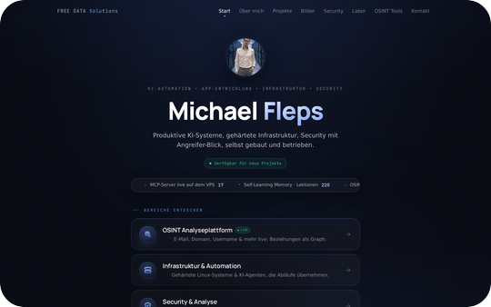
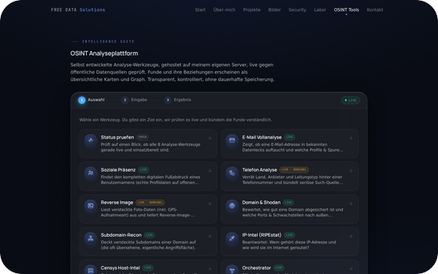
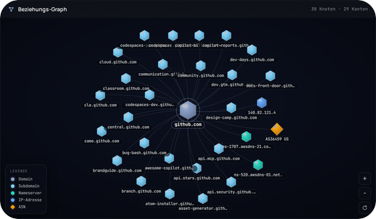
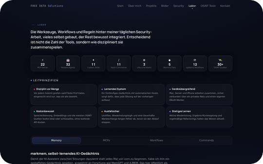
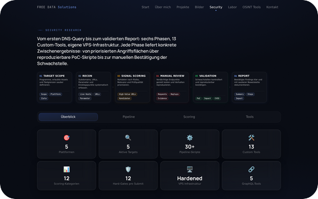
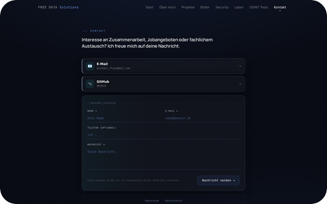
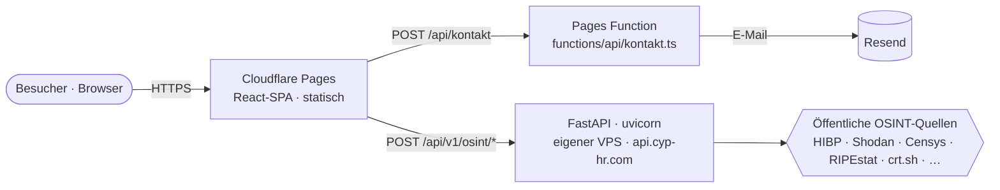
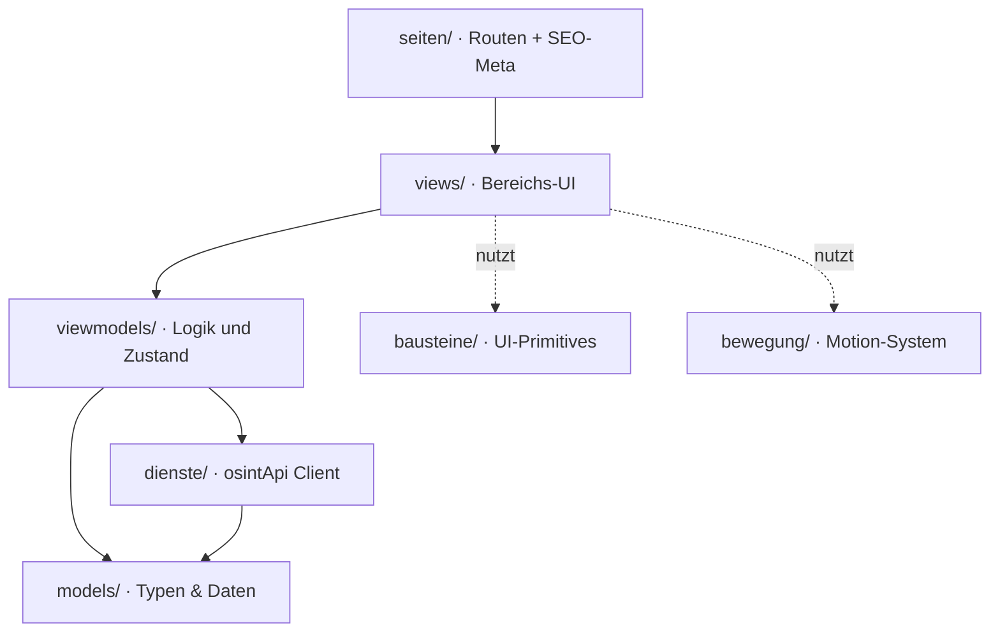
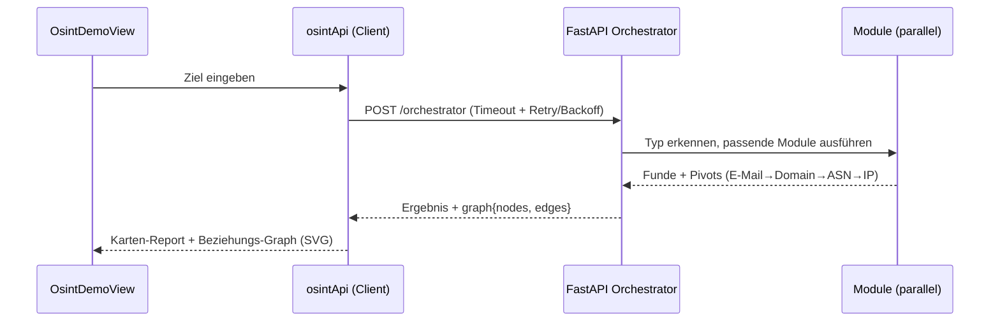

<div align="center">


### Portfolio &amp; OSINT-Analyseplattform

**KI-Automation · gehärtete Linux-Infrastruktur · Security mit Angreifer-Blick**

Eine in Eigenregie gebaute Single-Page-App mit einer echten, live betriebenen
OSINT-Intelligence-Suite — vom React-Frontend bis zur gehärteten FastAPI auf eigenem Server.

[](https://www.f3-data-solutions.com)
[](https://react.dev)
[](https://www.typescriptlang.org)
[](https://vite.dev)
[](https://tailwindcss.com)
[](https://fastapi.tiangolo.com)
[](https://pages.cloudflare.com)
[](https://securityheaders.com/?q=www.f3-data-solutions.com)
[](LICENSE)

</div>

---

## Über das Projekt

`neo-portfolio` ist die Codebasis hinter **[www.f3-data-solutions.com](https://www.f3-data-solutions.com)** —
dem persönlichen Portfolio von **Michael Fleps** (FREE DATA Solutions, Nürnberg).

Es ist bewusst kein Baukasten-Template, sondern eine durchgehend selbst entwickelte Anwendung mit
zwei Herzstücken:

- ein **Frontend** auf aktuellem Stand (React 19 · Vite 7 · TypeScript strict · Tailwind · Framer Motion),
  mit eigener MCVM-Architektur, kalmer Bewegungssprache und einem von Grund auf gehärteten Sicherheitsprofil;
- eine **live betriebene OSINT-Analyseplattform** — ein FastAPI-Backend auf eigenem VPS, das über 20 offene
  Datenquellen anzapft und Funde samt Beziehungen als interaktiven, komplett selbst gerechneten Graph darstellt.

> Alle OSINT-Werkzeuge arbeiten ausschließlich mit **öffentlich zugänglichen** Quellen, ohne dauerhafte
> Speicherung und mit maschinenlesbarer DSGVO-Transparenz je Werkzeug.

### Inhalt

[Screenshots](#screenshots) ·
[Highlights](#highlights) ·
[OSINT-Lab](#osint-lab--die-analyseplattform) ·
[Architektur](#architektur) ·
[Tech-Stack](#tech-stack) ·
[Security](#security--qualität) ·
[Entwicklung](#lokale-entwicklung) ·
[Deployment](#deployment) ·
[Struktur](#projektstruktur) ·
[Autor](#autor) ·
[Lizenz](#lizenz)

---

## Screenshots

<div align="center">
<table>
  <tr>
    <td align="center" valign="top">
      <br>
      <strong>Start</strong><br><sub>Hero &amp; Bereiche</sub>
    </td>
    <td align="center" valign="top">
      <br>
      <strong>OSINT-Terminal</strong><br><sub>8 Live-Werkzeuge</sub>
    </td>
    <td align="center" valign="top">
      <br>
      <strong>Intelligence-Graph</strong><br><sub>Maltego-Style, pures SVG</sub>
    </td>
  </tr>
  <tr>
    <td align="center" valign="top">
      <br>
      <strong>Labor</strong><br><sub>KI-Agenten &amp; Automation</sub>
    </td>
    <td align="center" valign="top">
      <br>
      <strong>Security</strong><br><sub>Research &amp; Härtung</sub>
    </td>
    <td align="center" valign="top">
      <br>
      <strong>Kontakt</strong><br><sub>gehärtetes Formular</sub>
    </td>
  </tr>
</table>
</div>

---

## Highlights

- 🕸️ **Selbst gerechneter Intelligence-Graph.** Der Maltego-Style-Beziehungsgraph
  (`src/bausteine/OsintGraph.tsx`) ist **reines SVG mit eigenem Force-Layout-Solver** —
  kein d3, kein cytoscape, kein WebGL. Knoten, Kanten und Physik von Hand.
- 🔭 **Echtes OSINT-Backend, kein Mock.** Eine FastAPI auf eigenem VPS bündelt **8 Analyse-Werkzeuge +
  Orchestrator** über 20+ öffentliche Quellen (HIBP, Shodan, Censys, RIPEstat, crt.sh, C2PA …).
- 🛡️ **Security by Design.** 9 Härtungs-Header (`securityheaders.com` **A+**), strikte CSP, OWASP-Top-10-
  Selbstaudit im Repo, Secrets nur serverseitig, Honeypot + Rate-Limit am Kontaktweg.
- ⚙️ **Ernsthafte CI/CD.** 4 GitHub-Actions-Jobs (Build/Test · `npm audit`-Gate · `pip-audit` · `gitleaks`),
  Dependabot, Auto-Deploy auf Cloudflare Pages inkl. Preview-URLs pro Branch.
- 🎬 **Kalme, kontrollierte Bewegung.** Eigene Motion-Bibliothek (`src/bewegung`) auf Framer Motion,
  durchgehend `prefers-reduced-motion`-treu.
- 🧱 **Saubere Architektur.** MCVM-Schichtung mit einseitiger Abhängigkeit, self-healing Lazy-Loading
  gegen veraltete Chunks, 0× `any` im gesamten `src/`.

---

## OSINT-Lab · die Analyseplattform

Das Flaggschiff unter **[/osint-tools](https://www.f3-data-solutions.com/osint-tools)**: ein Ziel eingeben,
live gegen öffentliche Quellen prüfen, Ergebnisse als verständliche Karten **und** als Graph.
Alle API-Schlüssel liegen ausschließlich im Backend — der Client fragt anonym an.

| # | Werkzeug | Was es beantwortet | Quellen (Auszug) | Schlüssel |
|---|----------|--------------------|------------------|-----------|
| 1 | **Status prüfen** | Sind alle 8 Werkzeuge live &amp; einsatzbereit? | interne Health-Checks | — |
| 2 | **E-Mail Vollanalyse** | Taucht die Adresse in Leaks auf? Welche Profile &amp; Spuren? | HIBP · XposedOrNot · LeakCheck · Gravatar · Google-GAIA · EmailRep · MX/SPF/DMARC | keyless |
| 3 | **Soziale Präsenz** | Kompletter digitaler Fußabdruck eines Benutzernamens | WhatsMyName (600+) · Bluesky · GitHub · GitLab · Reddit · Mastodon · Keybase · HN · Dev.to | keyless |
| 4 | **Telefon-Analyse** | Land, Anbieter, Leitungstyp hinter einer Nummer | libphonenumber · NumVerify · HLR-Live-Status | teils Key |
| 5 | **Reverse Image** | Versteckte Foto-Daten (EXIF/GPS), Manipulations-Check | EXIF · pHash/aHash/dHash · C2PA/Content-Credentials · ELA | keyless |
| 6 | **Domain &amp; Shodan** | Wie gut ist die Domain abgesichert, welche Ports/CVEs? | DNS · WHOIS · Team-Cymru-ASN · Shodan InternetDB · VirusTotal | teils Key |
| 7 | **Subdomain-Recon** | Versteckte, oft übersehene Angriffsfläche | crt.sh (Cert-Transparency) · Wayback · CommonCrawl | keyless |
| 8 | **IP-Intel** | Wem gehört die IP, wie ist sie geroutet? | RIPEstat (RIPE NCC) · VirusTotal | teils Key |
| 9 | **Censys Host-Intel** | Dienste, Zertifikate, AS &amp; Abuse-Kontakte einer IP | Censys Platform | Key |
| ✴ | **Orchestrator** | Erkennt den Typ automatisch, führt passende Module aus und **pivotet** (E-Mail → Domain → ASN → IP), Ergebnis als Graph | alle relevanten Module | — |

**Transport &amp; Robustheit** (`src/dienste/osintApi.ts`): typisierter `fetch`-Client mit `AbortController`
(15 s Standard, 75 s für lange Scans), bis zu **3 Wiederholungen** mit exponentiellem Backoff, sauber
typisiertes Fehlermodell (`Apifehler`), In-Memory-Cache für die Transparenz-Deklaration.

> ⚠️ **Verantwortungsvoll gedacht.** Die Werkzeuge nutzen nur öffentliche Daten. Sensible Module
> (Telefon, Reverse Image) sind als solche gekennzeichnet; es gibt keine dauerhafte Speicherung, und jedes
> Werkzeug legt über den Endpoint `/transparenz` maschinenlesbar offen, welche Drittdienste es serverseitig kontaktiert (DSGVO Art. 13/14).

---

## Architektur

### System-Kontext



Das Frontend ist eine rein statische, clientseitig gerenderte SPA. Es gibt **keine Sessions, kein Login,
keine Nutzerdaten** — nur zwei zustandslose Backend-Wege: das Kontaktformular (Cloudflare Pages Function
→ Resend) und die OSINT-API (FastAPI auf eigenem Server, außerhalb dieses Repos betrieben).

### Frontend-Schichten (MCVM)



Einseitige Abhängigkeit `View → ViewModel → Dienste → Model`; Darstellung ist strikt von Daten/Logik
getrennt. Deutsche Domain-Ordnernamen sind bewusst Teil der Ubiquitous Language des Projekts.

### OSINT-Request-Flow



### Projektbaum (verkürzt)

```
neo-portfolio/
├─ src/
│  ├─ app/          # Einstieg, Router, Provider, Chunk-Selbstheilung
│  ├─ seiten/       # Seiten (eine pro Route) + SEO-Meta
│  ├─ views/        # Bereichs-UI (Hero, OSINT-Demo, Security, …)
│  ├─ viewmodels/   # Logik & Zustand
│  ├─ dienste/      # osintApi — typisierter API-Client
│  ├─ models/       # Typen & Inhaltsdaten
│  ├─ bausteine/    # UI-Primitives (InfoKarte, Knopf, …) + osint/ + OsintGraph
│  ├─ bewegung/     # Motion-System (Varianten, Hooks, Effekte)
│  ├─ zustaende/    # globaler React-Context
│  └─ gestaltung/   # Fonts & globale Styles
├─ api/             # FastAPI-OSINT-Backend (separat auf VPS deployed)
├─ functions/       # Cloudflare Pages Function (Kontakt → Resend)
├─ public/          # statische Assets, _headers, _redirects
├─ docs/            # Sicherheits-Selbstaudit, Branch-Protection, README-Assets
└─ .github/         # CI + Deploy-Workflows, Dependabot
```

---

## Tech-Stack

**Frontend**

| Bereich | Technologie |
|---------|-------------|
| Framework | React `19.1` · react-router-dom `7.9` (BrowserRouter, Client-SPA) |
| Build | Vite `7.1` · TypeScript `5.9` (`strict`) |
| Styling | Tailwind CSS `3.4` · PostCSS · Autoprefixer |
| Motion | Framer Motion `12.23` (reduced-motion-treu) |
| SEO | react-helmet-async `3.0` (per-Route-Meta) |
| Fonts | `@fontsource` Manrope · Inter · JetBrains Mono (self-hosted, kein CDN) |
| Tests | Vitest `4.1` · Testing-Library · jsdom |

**Backend** (`api/`, FastAPI auf eigenem VPS)

| Bereich | Technologie |
|---------|-------------|
| API | FastAPI ≥ `0.135` · uvicorn · slowapi (Rate-Limit) · Pydantic 2 |
| Netz/Analyse | httpx · dnspython · python-whois · phonenumbers |
| Bild-Forensik | Pillow · ImageHash · c2pa-python · defusedxml |
| Betrieb | systemd-Unit, gehärtet (NoNewPrivileges, ProtectSystem=strict, Memory/CPU-Limits) |

**Infrastruktur & CI**

| Bereich | Technologie |
|---------|-------------|
| Hosting | Cloudflare Pages (Projekt `f3-portfolio`) · Push auf `main` = Auto-Deploy |
| Kontakt | Cloudflare Pages Function → Resend |
| CI | GitHub Actions: Build/Test · `npm audit`-Gate · `pip-audit` · `gitleaks` |
| Wartung | Dependabot (npm + Actions, wöchentlich) |

---

## Security &amp; Qualität

Sicherheit ist Teil des Designs, nicht nachträglich. Der vollständige **OWASP-Top-10-Selbstaudit** liegt
im Repo: [`docs/sicherheits-selbstaudit.md`](docs/sicherheits-selbstaudit.md) (Ergebnis **9× ✅, 1× ⚠️**).

- **Header-Härtung:** 9 Sicherheits-Header live, `securityheaders.com` **A+** — strikte CSP
  (`script-src 'self'`, kein Inline-/eval-JS), `X-Frame-Options: DENY`, `frame-ancestors 'none'`,
  `HSTS … preload`, restriktive `Permissions-Policy`, COOP/CORP `same-origin`, `Server`-Header entfernt
  (`public/_headers`).
- **Kontakt-Funktion gehärtet:** strikte CORS-Allowlist, Honeypot-Feld, 10 KB Body-Cap, Längen-/Format-Limits,
  8 s Timeout, Methoden-Whitelist, Trace-IDs statt sensibler Logs.
- **Secrets:** ausschließlich als Server-ENV; `.env*` ist gitignored, `gitleaks` scannt die ganze Historie.
- **Abhängigkeiten:** `npm audit`-Gate (Prod-Deps, high+) und `pip-audit` als CI-Pflicht; Dependabot hält alles frisch.
- **Code-Hygiene:** TypeScript `strict`, **0× `any`** in `src/`, Vitest-Tests im Frontend + pytest im Backend.

---

## Lokale Entwicklung

**Voraussetzungen:** Node.js `20+` und npm. (Optional für das OSINT-Backend: Python `3.12`.)

```bash
# Frontend
npm ci
npm run dev        # Dev-Server auf http://localhost:3000
npm run test       # Vitest (Watch);  npm run test:run für einen Durchlauf
npm run typecheck  # tsc --noEmit
npm run build      # tsc -b && vite build  ->  dist/
npm run preview    # Produktions-Build lokal ansehen (Port 4173)
```

**Umgebungsvariable (Frontend):** `VITE_OSINT_API_URL` — Basis-URL der OSINT-API.
Ohne Angabe greift der Fallback `https://api.cyp-hr.com`. Backend-Schlüssel (NumVerify, VirusTotal,
Censys) leben ausschließlich serverseitig, nie im Client-Bundle.

```bash
# OSINT-Backend (optional, lokal)
cd api
pip install -r requirements.txt
uvicorn main:app --reload   # FastAPI auf http://localhost:8000
```

---

## Deployment

Cloudflare Pages, vollautomatisch:

- **Push auf `main`** → Production-Deploy auf `www.f3-data-solutions.com`.
- **Push auf jeden anderen Branch / PR** → Preview-Deploy unter einer `*.pages.dev`-URL (als PR-Kommentar).

Die Pipeline (`.github/workflows/deploy-pages.yml`) läuft `tsc --noEmit` → `vite build` → `wrangler pages deploy`.
SPA-Routing über `public/_redirects` (`/* → /index.html 200`), Cache-Regeln über `public/_headers`
(`index.html` immer revalidieren, gehashte Assets `immutable`, 1 Jahr).

---

## Projektstruktur

Kurz erklärt, weil die Ordnernamen bewusst deutsch sind:

| Ordner | Rolle |
|--------|-------|
| `seiten/` | Seiten — je eine pro Route, setzt SEO-Meta |
| `views/` | Sichtbare Bereichs-UI |
| `viewmodels/` | Logik &amp; Zustand hinter den Views |
| `dienste/` | Services — v. a. der OSINT-API-Client |
| `models/` | Typen &amp; Inhaltsdaten |
| `bausteine/` | Wiederverwendbare UI-Primitives (+ `osint/`, `OsintGraph`) |
| `bewegung/` | Bewegungs-/Animations-System |
| `zustaende/` | Globaler App-Zustand (React-Context) |
| `gestaltung/` | Schriften &amp; globale Styles |

---

## Autor

**Michael Fleps** — FREE DATA Solutions, Nürnberg
KI-Automation &amp; Integration · gehärtete Linux-Infrastruktur · Security mit Angreifer-Blick.

🌐 [www.f3-data-solutions.com](https://www.f3-data-solutions.com) · 🐙 [github.com/NEO849](https://github.com/NEO849)

---

## Lizenz

Veröffentlicht unter der **MIT-Lizenz** — siehe [`LICENSE`](LICENSE).

<sub>Die OSINT-Werkzeuge dienen der Analyse öffentlich zugänglicher Informationen im Rahmen der geltenden
Gesetze. Namen von Drittdiensten und -quellen gehören ihren jeweiligen Eigentümern.</sub>
